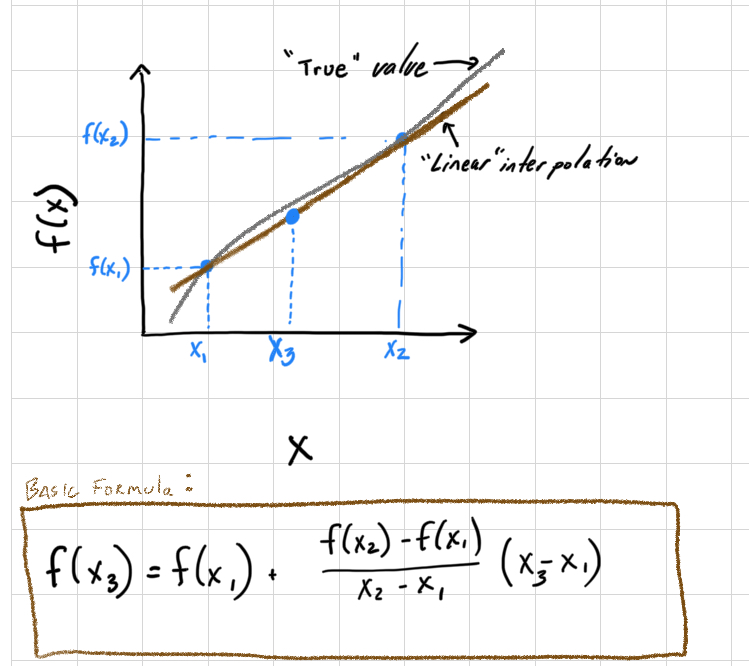

```{r setup}
knitr::opts_chunk$set(echo = TRUE)
library(ggplot2)
library(tidyverse)
library(PolynomF)
library(pracma)
```


# Overview

Within the Engineering discipline, we often use interpolation techniques to estimate a value. For example, imagine you are using a thermodynamic table to look up the specific enthalpy of water at 33.4&deg;C. The table has values for 30&deg;C and 35&deg;C; thus, you need to interpolate the value at 33.4&deg;C. This week we'll look at different interpolation approaches for such problems. More advance interpolation for 2-D surfaces includes interpolating properties across a surface---for example, estimating average annual rainfall across a state or country uses interpolation and modeling approaches (e.g. see [https://prism.oregonstate.edu/normals/](https://prism.oregonstate.edu/normals/)) since rainfall is not measured everywhere. We'll focus on 1-D examples in this unit; there's an excellent appendix with examples at the end of [Manuel Gimond's book on spatial analysis](https://mgimond.github.io/Spatial/app1-1.html).

* One might ask what the difference is between interpolation and regression: in contrast to regression, interpolation schemes result in the line going through every observational point exactly. The goal is to make the most accurate predictions of values between experimental observations, not to define the most simple, or mechanistic model that fits the data.

## Linear interpololation

The most basic interpolation approach is to assume a straight line between 2 points. Imagine you want to estimate a value $x_3$ based on the following diagram. The simplest approach is to assume a linear line connects $x_1$ and $x_2$. Using your knowledge of $x_1$, $f(x_1)$, $x_2$, and $f(x_2)$, the equation to calculate the slope of the line to estimate $f(x_3)$ is

$$
f(x_3) = f(x_1) + \frac{f(x_2) - f(x_1)}{x_2 - x_1} (x_3 - x_1)
$$

```{r echo=FALSE, fig.align='center', fig.cap=true, fig.cap='Linear interpolation diagram with equation.', out.width='50%'}

```
Let's look at an example. Suppose you have a table for the specific volume of a gas. You've been asked for the value at 377&deg;C, and you know the following:

- T @ 360&deg;C, specific volume = 4.789 cubic liters/kg
- T @ 380&deg;C, specific volume = 5.987 cubic liters/kg

```{r Linear Interpolation Simple Example, echo=TRUE}
fx1 <- 4.789
fx2 <- 5.987
x1 <- 360
x2 <-380
x3 <- 377
lin_interp <- function(fx1,fx2,x1,x2,x3) fx1+((fx2-fx1)/(x2-x1))*(x3-x1)
fx3 <- lin_interp(fx1,fx2,x1,x2,x3)
fx3
```

So the specific volume at $x_3 =$ `r x3`&deg;C is `r fx3` cubic liters/kg.

## Curvature and Interpolation.

There are different approaches to introduce curvature into an interpolation scheme to reduce the error. Here, we'll explore polynomials and spline functions.

### Polynomial Interpolation

Polynomials are frequently used in interpolation, and they provide one approach to inducing curvature into the interpolation. We generally use 2 basic approaches: Newtons and Lagrange polynomials. Under most conditions, Newtons method is more computationally efficient and we'll use this approach here. In essence, a term (or terms) is added to the linear interpolation that includes curvature. Thus, if you have 3 data-points, a simple quadratic equation would suffice. If you have 4 points, a third order polynomial (4-1) would go through all the points. The general form of the polynomial is using Newton's method. If you remember, we talked briefly during regression week about over-fitting models. In interpolation we are purposely over fitting to use all available information to predict intermediate values. 

Suppose we have the following dataset:

x  = 0, 2, 3, 4  
y = 7, 11, 28, 63

Plot the data and use the `poly_calc()` function within the `PolynomF` package. Here, the `polycalc` function creates a polynomial (that I assign to `a`) that can then be used for interpolation (I evaluated the polynomial a at all points in the xx vector). 

```{r echo=FALSE}
library(PolynomF)
x <- c(0, 2, 6, 8)
y <- c(7, 11, 28, 13)

a <- poly_calc(x,y)
xx <- seq(0,8,.1)
yy <- a(xx)
dat2<- data.frame(cbind(xx, yy))


dat <- data.frame(cbind(x, y))

pp <- ggplot() + 
  geom_point(data=dat,aes(x=x, y=y),size=3, col='blue') +
  geom_line(data=dat2,aes(x=xx,y=yy))
pp
```


The resulting polynomial function can be accessed as shown below and is an R function as well:

```{r}
a
a(x = 5)
```

Now what happens when we extrapolate beyond the observed data we used to generate the function? Imagine we had another observation that was just determined. You can see in the plot below that the original polynomial will result in a poor extrapolation! 

```{r}
xx <- seq(0,10,.1)
yy <- a(xx)
dat2<- data.frame(cbind(xx, yy))
x[5] <- 10
y[5] <- 25

dat <- data.frame(cbind(x, y))

pp <- ggplot() + 
  geom_point(data=dat,aes(x=x, y=y),size=3, col='blue') +
  geom_line(data=dat2,aes(x=xx,y=yy))
pp
```

**Thus, caution is needed when using and interpreting the results of interpolation and _especially_ extrapolation.**

### Splines Interpolation

Let's redo our example using "the method of splines", instead of polynomial interpolation. Splines are piecewise polynomial interpolations, so there can be a different polynomial function between each pair of points, but each polynomial takes into account the ones next to it in order to minimize the roughness of the curve. You can imagine this as bending a thin piece of wood to fit all of the points, [which is actually where the method comes from in the early days of the airline industry](https://en.wikipedia.org/wiki/Spline_(mathematics)#History).  We can implement interpolation by splines (as well as many other methods we will demonstrate) via `interp1` within the `pracma` package:

```{r, eval=FALSE}
#The general usage of interp1 
interp1(x, y, xi = x, method = c("linear", "constant", "nearest", "spline", "cubic"))
```

### Spline interpolation: introduces some simple curvature

```{r}
xx <- seq(0,8,.01)
yy <- interp1(x, y, xi = xx, method = c("spline"))
dat2<- data.frame(cbind(xx, yy))
pp <- ggplot() + 
  geom_point(data=dat,aes(x=x, y=y),size=3, col='blue') +
  geom_line(data=dat2,aes(x=xx,y=yy))
pp

```


#### Additional methods in the `interp1` function

In addition to splines `interp1` has several other methods.

##### Linear interpolation

```{r}
yy <- interp1(x, y, xi = xx, method = c("linear"))
dat2<- data.frame(cbind(xx, yy))
pp <- ggplot() + 
  geom_point(data=dat,aes(x=x, y=y),size=3, col='blue') +
  geom_line(data=dat2,aes(x=xx,y=yy))
pp

```

##### Constant interpolation: assume same value as previous (no knowledge of future value)

```{r}
xx <- seq(0,8,.01)
yy <- interp1(x, y, xi = xx, method = c("constant"))
dat2<- data.frame(cbind(xx, yy))
pp <- ggplot() + 
  geom_point(data=dat,aes(x=x, y=y),size=3, col='blue') +
  geom_line(data=dat2,aes(x=xx,y=yy))
pp

```

##### Nearest interpolation: assume same value as closest observation

```{r}
xx <- seq(0,8,.01)
yy <- interp1(x, y, xi = xx, method = c("nearest"))
dat2<- data.frame(cbind(xx, yy))
pp <- ggplot() + 
  geom_point(data=dat,aes(x=x, y=y),size=3, col='blue') +
  geom_line(data=dat2,aes(x=xx,y=yy))
pp

```


### Oscillations 

Back to our splines and polynomials...

Oscillations are another issue that come into play in any polynomial-based interpolation. Splines are an alternative to polynomials that result in a simplified interpolation. Splines

- apply lower-order polynomials in a piecewise fashion to subsets of data points, and
- minimize oscillations and reduce round-off error due to their lower-order nature.

But they are not always perfect!

```{r}
x <- seq(-1,1,.5)
y <- 1/(1+25*x^2) # Runge's function

a <- poly_calc(x,y)
xx <- seq(-1,1,.01)
yy <- a(xx)
dat3<- data.frame(cbind(xx, yy))

# When we plot Runge's function:

yyy <- 1/(1+25*xx^2)
xxx <- seq(-1,1,.01)
dat4<- data.frame(cbind(xxx, yyy))

dat <- data.frame(cbind(x, y))

pp <- ggplot() + 
  geom_point(data=dat,aes(x=x, y=y),size=3, col='blue') +
  geom_line(data=dat3,aes(x=xx,y=yy),col="red") +
  geom_line(data=dat4,aes(x=xxx,y=yyy),col="black")
pp
```

The black line is the true value from the function, the red line is from the interpolation using a polynomial. This illustrates the importance of being careful with higher order polynomials! If we use splines here the fit is a little better, but still has some oscillations. 

```{r}
dat5 <- data.frame(x = xx, y = interp1(x, y, xi = xx, method = "spline"))
ggplot() + 
  geom_point(data=dat,aes(x=x, y=y),size=3, col='blue') +
  geom_line(data=dat3,aes(x=xx,y=yy),col="red") +
  geom_line(data=dat4,aes(x=xxx,y=yyy),col="black") + 
  geom_line(data = dat5, aes(x = x, y = y), col = "green")

```

The best way to improve interpolation is to increase the amount of data you feed into the interpolation algorithm. If instead of using 5 points we use 9, the splines have a much better fit to the function the blue data points were pulled from. 

```{r}
x <- seq(-1,1,.25)
y <- 1/(1+25*x^2) 
dat <- data.frame(x, y)

dat6 <- data.frame(x = xx, y = interp1(x, y, xi = xx, method = "spline"))

ggplot() + 
  geom_point(data=dat,aes(x=x, y=y),size=3, col='blue') +  
  geom_line(data=dat4,aes(x=xxx,y=yyy),col="black") + 
  geom_line(data = dat6, aes(x = x, y = y), col = "green")
```

## Example - CO~2~ at Mana Loa Observatory

The Mana Loa observatory contains the longest *in situ* record of CO~2~ in the atmosphere. We've downloaded this data from  ftp://aftp.cmdl.noaa.gov/products/trends/co2/co2_annmean_mlo.txt. 

Let's read in this data and do some extrapolation. Instead of using the `lin_interp` function we wrote, we can just make linear regression model of the data. 

```{r}
coln <- c("year","co2","y")
dfc <- read_delim("co2_annmean_mlo.txt",delim = "   ", comment = "#",col_names = coln)

dfc$year <- as.numeric(dfc$year)
dfc$co2 <- as.numeric((dfc$co2))
plot(dfc$year,dfc$co2)


```

Using this data let's extrapolate the CO~2~ level at 2100. We'll start with linear interpolation and in the assignment you will try polynomial and splines.

```{r}
m <- lm(co2 ~ year, data = dfc)

xx <- seq(1970, 2100, 1)
xxd <- data.frame(xx)
colnames(xxd) <- "year"
yy <- predict(m, xxd)

lm_co2 <- data.frame(cbind(xx, yy))

pp <- ggplot() +
  geom_point(
    data = dfc,
    aes(x = year, y = co2),
    size = 1,
    col = 'blue'
  )
pp  +
  geom_line(data = lm_co2, aes(x = xx, y = yy))
```

Well over 550 ppm CO~2~ by 2100. But this doesn't really fit the data very well. Perhaps we could improve a bit by using our `lin_interp` function on the last 2 datapoints. 

```{r}
lin_extrap_data <- tail(dfc, n = 2)
lin_interp(fx1 = lin_extrap_data[[1,"co2"]],
           fx2 = lin_extrap_data[[2,"co2"]], 
           x1 = lin_extrap_data[[1,"year"]],
           x2 = lin_extrap_data[[2,"year"]], 
           x3 = 2100)
m2 <- lm(co2 ~ year, data = lin_extrap_data)

```

620 ppm! That's more than 10% higher, but does it visually fit better? We can use the `geom_abline` function from `ggplot2` to plot a line with the right slope and intercept, although it would probably be easier to go back and make a linear model with the `lin_extrap_data` and use `predict` to make a line as we did above. 

```{r}
pp +
  geom_abline(slope = (lin_extrap_data[[2,"co2"]] - 
                         lin_extrap_data[[1,"co2"]]) / 
                      (lin_extrap_data[[2,"year"]] - 
                        lin_extrap_data[[1,"year"]]), 
              intercept = lin_extrap_data[[1,"co2"]] -
                          (lin_extrap_data[[2,"co2"]] - 
                         lin_extrap_data[[1,"co2"]]) / 
                      (lin_extrap_data[[2,"year"]] - 
                        lin_extrap_data[[1,"year"]])*
  lin_extrap_data[[1,"year"]], 
  color = "grey") + 
  ylim(300, 800)
```

What do you think the predictions from polynomial and splines will be? 

```{r}
co2_poly <- poly_calc(dfc$year, dfc$co2)
dfc_pred <- data.frame(year = xx, co2_poly = co2_poly(xx))
pp + geom_line(data = dfc_pred, mapping = aes(x = year, y = co2_poly))


```

```{r}
m3 <- lm(co2 ~ poly(x = year, degree = 6, raw = TRUE), data = dfc)
summary(m3)
dfc_pred$co2_m3 <- 
  m3 %>% predict(dfc_pred) 
pp + geom_line(data = dfc_pred, mapping = aes(x = year, y = co2_m3))

```
To see the predicted CO~2~ concentration in the year 2100 we can use `tail` to look at the last line of `dfc_pred`
```{r}
dfc_pred %>% tail(n = 1)
```

We could also use `stat_smooth` to plot the model object and include confidence intervals around our prediction. Within `stat_smooth` our formula needs to be in terms of x and y, which correspond to the variables mapped back in the `ggplot` call when we defined `pp`; so looking back `aes(x = year, y = co2)`. To expand the range of the model predictions in `stat_smooth` we need to add `fullrange = TRUE` and then use `xlim` to expand the x-axis. 

```{r}
## Note that previously (and still above for pp) the data and mapping arguments
## were in the `geom_point`, 
## which was why stat_smooth was not working in class.  
# TODO fix pp above, and also rename...
ggplot(data = dfc,
    aes(x = year, y = co2)) +
  geom_point(size = 1) + 
  stat_smooth(method = lm, formula = y ~ poly(x = x, degree = 3, raw = TRUE), 
              fullrange = TRUE) + 
  xlim(1959, 2100)
```

Finally, we can use the method of splines by similarly defining a splines model using the `bs` (stands for [b-splines, which are a type of spline](https://en.wikipedia.org/wiki/B-spline)) from the `splines` package.  

```{r}
library(splines)
m_splines <- lm(co2 ~ splines::bs(year, knots = dfc$co2), data = dfc)
dfc_pred$co2_m_splines <- 
  m_splines %>% predict(dfc_pred) 
pp + geom_line(data = dfc_pred, mapping = aes(x = year, y = co2_m_splines))
```

```{r}
dfc_pred %>% tail(n=1)
```

```{r}
ggplot(data = dfc,
    aes(x = year, y = co2)) +
  geom_point(size = 1) + 
  stat_smooth(method = lm, formula = y ~ bs(x = x, knots = dfc$co2), 
              fullrange = TRUE) + 
  xlim(1959, 2100)
```


